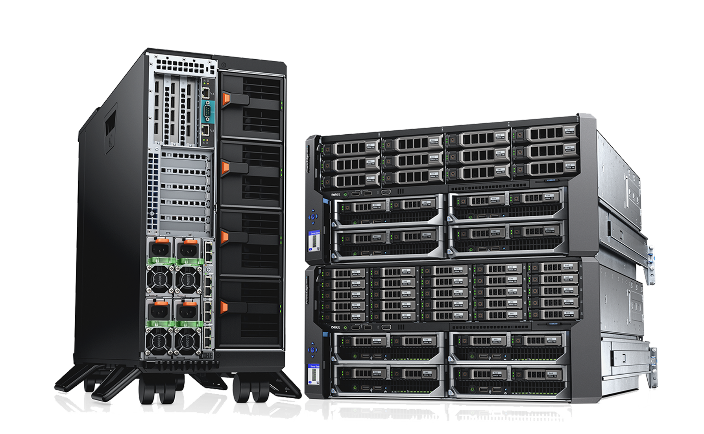
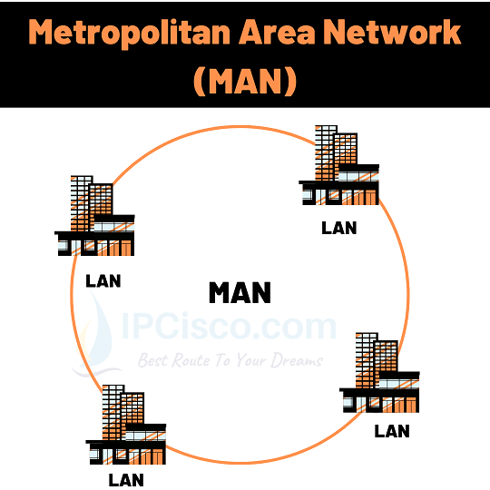
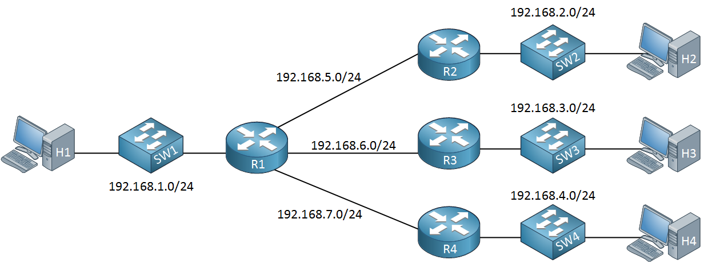

# What is Computer Network
---
##### ● A network consists of two or more entities or objects sharing resources and information.
##### ● A computer network consists of two or more computing devices connected to each other to share resources and information.
---

# Need of Networks 
---
##### ● Enhance communication.
##### ● Share resources.
##### ● Facilitate centralized management.
##### ● Internet.
---

# Client and Server Computer
---
### 1. Client Computer
#####           ● A client is a device that accesses a service made available by a server.
#####           ● Ex:
#####                ● laptop
#####                ● Phone
#####                ● tablet

### 2. Server Computer
#####           ● A device that provides functions or services for clients.
#####           ● have higher RAM,CPU and STORAGE
#####           ● Ex:

---

# Classification of Networks
---
## 1. Classification by network geography
#####           ● Networks are frequently classified according to the geographical                              boundaries spanned by the network itself.
#####           ● LAN, WAN, and MAN are the basic types of classification, of                                         which LAN and WAN are frequently used.

##          Local area network (LAN)
#####                     ○ A LAN covers a relatively small area such as a classroom, school, or                          a single building.
#####                     ○ LAN's are inexpensive to install and also provide higher speeds.

##           Metropolitan area network (MAN)
#####                     ○ A MAN spans the distance of a typical metropolitan city.
#####                     ○ The cost of installation and operation is higher.
#####                     ○ MAN's use high-speed connections such as fiber optics to achieve                           higher speeds.

##           Wide area network (WAN)
#####                     ○ WAN's span a larger area than a single city.
#####                     ○ These use long distance telecommunication networks for                                              connection, thereby increasing the cost.
#####                     ○ The Internet is a good example of a WAN.

## 2. Classification by Component Roles
#####           ● Networks can also be classified according to the roles that the                                   networked computers play in the network’s operation.
#####           ● Peer-to-peer, server-based, and client-based are the types of                                    roles into which networks are classified.

##           Peer-to-peer

#####                     ○ In a peer-to-peer network, all computers are considered equal.
#####                     ○ Each computer controls its own information and is capable of                                   functioning as either a client or a server depending upon the                                       requirement.
#####                     ○ Peer-to-peer networks are cheap and easy to install.
#####                     ○ They are popular as home networks and for use in small companies.
#####                     ○ Most operating systems come with built-in peer-to-peer                                               networking capability.
#####                     ○ The maximum number of peers that can operate on a peer-to-peer                         network is ten.
#####                     ○ Each peer shares resources and allows others open access to                                   them.

##           Server based
#####                     ○ A server-based network offers centralized control and is designed                           for secure operations.
#####                     ○ In a server-based network, a dedicated server controls the                                          network.
#####                     ○ A dedicated server is one that services the network by storing                                  data, applications, resources, and also provides access to                                            resources required by the client.

 

##           Client-based
#####                     ○ Client-based network servers process requests from clients and                               return just the results.
#####                     ○ These networks take advantage of the powerful processing                                         capabilities of both the client and the server.

---

# IP /Internet Protocol/ address
---
##### ● IP (Internet Protocol) is a Network Layer Protocol.
##### ● A way to identify machines on a network
##### ● A unique identifier

## USAGE of IP’s
#####           ○ Used to connect to another computer or network.
#####           ○ Allows transfers of files and e-mail
#####           ○ Identify a device

## IP types
####           ● Based On IP versions
######                     ○ IPv4
######                     ○ IPv6

##          1. IPv4 ( Internet protocol version 4)
#####                     ○ An IPv4 address is a 32-bit sequence of 1s and 0s.
#####                     ○ To make the IP address easier to use, the address is usually written                          as four decimal numbers separated by periods.
#####                     ○ This way of writing the address is called the dotted decimal format.
#####                     ○ IP generated by DHCP or Manually

##         IP structure

#####                     ● IP addresses consist of four sections

#####                     ● Each section is 8 bits long

#####                     ● Each section can range from 0 to 255

####                    ● When you connect to some network an IP address will be                            generated and given.
####                     ● Every IP address has two parts:
####                               ○ Network: to identify the network( የእናንተ,የጎረቤት)
####                               ○ Host: identify the user(ስልክ,PC)

####                     ● The first(1) host address is called GATEWAY ADDRESS.

##        Private and Public IP addresses.

#####                     ● Any HOST have 2 different IP’s
#####                     ● Public IP:
#####                               ○ is an ip address that is given to the host on the WAN network
#####                     ● Private IP:
#####                               ○ is ip that is given to the host on LAN network.
#####                               ○ Internet and intranet?

##         There are 5 classes of private IP address A B C D & E

#####                     ➔ CLASS A: Governments
#####                     ➔ CLASS B: medium Companies
#####                     ➔ CLASS C: small companies
#####                     ➔ CLASS D: MultiCasting(streaming)
#####                     ➔ CLASS E: Future Use (IETF research)

###                   CLASS A
#####                               ● Have 24bit of space for HOSTS
#####                               ● The First octet ( 10 ) address change 0 - 127

###                   CLASS B
#####                               ● Have 16bit of space for HOSTS
#####                               ● The first octet ( 172 ) address change 128 - 191

###                   CLASS C
#####                               ● Have 8bit of space for HOSTS and 24-bit of network
#####                               ● The First octet ( 192 ) address change 192 -223

#####                               ● It is Used on Our Home,school and Office Network.
#####                               ● As we saw the host changes on the last 8 bit only so devices                                       in same network have same starting numbers.
#####                               Ex:
#####                                         -> 192.168.1.1
#####                                         -> 192.168.123.6
#####                                         -> 192.168.24.8

##         Reserved IP Addresses

#####                     ● Certain host addresses are reserved and cannot be assigned to                                 devices on a network.
#####                               a. Addresses beginning 127 are reserved for loopback and                                                internal testing
#####                               b. An IP address that has binary 0s in all host bit positions is                                             reserved for the network address.
#####                               c. An IP address that has binary 1 or 255s in all host bit positions                                    is reserved for the broadcast address

###                    Examples of Reserved addresses
#####                               ● 0.0.0.0
#####                               ● 127.0.0.0
#####                               ● 128.0.0.0
#####                               ● 191.255.0.0
#####                               ● 192.0.0.0
#####                               ● 223.255.255.0

##          IPv6 ( Internet Protocol Version 6)

#####                     ● IPv6 is a 128-bit alphanumeric long value that identifies an                                          endpoint devices in IPv6 network.
#####                     ● Format of an IPv6 address:
#####                               ○ FE80:CD00:0000:0CDE:1257:0000:211E:729C
#####                                         ■ ALPHANumeric
#####                                         ■ Separated by colon(:)
#####                                         ■ IP generated automatically.
#####                     ● The main difference is the IP-space(host holding) IPv4 holds 32-bit                           ip address but IPv6 holds 128-bit ip Addresses.

###          To know your computer ip address
###          On windows:
####                     ● ipconfig

###         On Linux
####                     ● ifconfig

---

# MAC(Media Access Control) Address
---
##### ● It is Given by A manufacturer of that network adapter.
##### ● Network adapter is a hardware device that helps us to have connection ( our wifi adapter or our ethernet port)
##### ● It is Alphanumeric, with 2 part
#####           ○ Organizational Unique Id
#####           ○ Universally Administered Address

## MAC(Media Access Control) Address

#####           ● Flat name space of 48 bits
#####                     ○ Typically written in six octets in hex
#####                     ○ E.g., 00-15-C5-49-04-A9 for my Ethernet
#####           ● Organizationally unique identifier
#####                     ○ Assigned by IEEE Registration Authority
#####                     ○ Determines the first 24 bits of the address
#####                     ○ E.g., 00-15-C5 corresponds to “Dell Inc”
#####           ● Remainder of the MAC address
#####                     ○ Allocated by the manufacturer
#####                     ○ E.g., 49-04-A9 for my Ethernet card

---

# Intranet
---
#####  ● An intranet is a private network contained within an enterprise that is used to securely share company information and computing resources among employees.
##### ● An intranet is defined as a private internal network that helps an organization’s employees communicate, collaborate, access information, and perform work-related tasks. Today’s [intranet solutions](https://www.interactsoftware.com/) help connect digital workplaces, serving to increase employee engagement and bring employees together across roles, departments, and locations.

---

# Subnetting
---
##### ● **Subnetting** is a method used in computer networking to divide a larger network (IP address block) into smaller, more manageable **sub-networks**, or **subnets**. It helps organize and improve the efficiency, security, and performance of networks.

### 🔍 Why Subnet?

1. **Better Network Management**
    
    - Subnets group devices logically (e.g., by department or location).
        
    - Easier to isolate problems and control traffic.
        
2. **Improved Security**
    
    - Devices in different subnets can be isolated using firewalls or routers.
        
3. **Efficient IP Address Usage**
    
    - Prevents wasting IP addresses, especially in large networks.
        
---

## CLASS                          IP                      SUBNET MASK
##### class A                                  10.2.7.9                                  255.0.0.0 
##### class B                                  128.7.3.1                                255.255.0.0
##### class C                                 192.168.1.10                         255.255.255.0

## Power of Two(2) Chart. ( Nosferat )
#### 2^7          2^6          2^5          2^4          2^3          2^2          2^1          2^0 
#### 128          64            32            16              8              4               2              1 

## 1. Chang Bit(Binary) into Decimal. 
#### ● ex :-
#####          11000000.10101000.00000001.00010101
#### ● To change it you can use power of 2 chart ( Nosferat )

##### 1               1             0             0           0           0          0        0
##### 128         64          32          16          8          4          2          1

##### ● And take a on number or 1 number and added it.
####                     128 + 64 = 192
####                     128 + 32 + 8 = 168
####                                                  1
####                       16 + 4 + 1 = 21

#### ● So "11000000" into decimal "192" .
#### ● And you can calculate each one like this.
#### ● 11000000.10101000.00000001.00010101        ==         192.168.1.21

## 2. Change Decimal into Binary.
#### ● ex :-
####           172.168.34.3
#### ● To change it you can use power of 2 chart ( Nosferat )
##### 128         64          32          16          8          4          2          1
#####    1            0             1             0           1           1          0        0

####                           172 - 128 = 44
####                           44 - 32 = 12
####                           12 - 8 = 4
####                           4 - 4 = 0

#### ● So "172" into binary "10101100".
#### ● And you can calculate each one like this.
#### ● 172.168.34.3      ==      10101100.10101000.00100010.00000011

## 3. Change Subnet Mask into Binary.
#### ● ex :-
####           255.255.255.0
#### ● To change it you can use power of 2 chart ( Nosferat )
#### ● 255.255.255.0     ==     11111111.11111111.11111111.00000000
#### ● " 1 " is a Network bit and " 0 " is Host bit
#### ● it 254 usable ip
#### ● but you need 500 usable ip in your network, you need to still on a network bit, like this.
#### ● 11111111.11111111.11111110.00000000       ==       255.255.254.0
#### ● and new you can calculate how many ip is usable, like this
#####           ● First count a 0 or host bit.
#####           ● Second calculate a host bit on 2^hostbit
#####                     ● ex :- 2^9  =  512.
#####           ● new 512 usable ip on the network.

## Power of Two(2) Chart 2. ( Nosferat 2 )
#### 128          64               32           16               8              4              2             1
#### 256          128            64           32              16             8              4              2 

#### ● and let's go subnet a network.
#### ● you need a 4 subneted network's.

## 1. Calculate how many Host Bit's you Need to Hack.
####           ● So in this case i need 4 subnet network's.
####           ● 11111111.11111111.11111111.00000000
####           128          64          32          16          8          4          2          1
####           256          128        64          32         16         8        [4]         2
####           ● So to get a 4 network you need to be still 2 bit from a host bit.

## 2. Hack the Host Bit.
####           ● ex :-
####                     ● 11111111.11111111.11111111.11000000
####                     ● 255.255.255.192
####           ● 192.168.1.0
####           ● 255.255.255.192

## 3. Find the increment.
####           ● The increment is "64".

## 4. Create your Network's.
####           ● 192.168.1.0/26  -  192.168.1.63/26
####           ● 192.168.1.64/26  -  192.168.1.127/26
####           ● 192.168.1.128/26  -  192.168.1.191/26
####           ● 192.168.1.192/26  -  192.168.1.255/26

#### ● To find a how many host in a network count a subnet host bit and power by 2.
#### ● ex :-
####           ● 11111111.11111111.11111111.11000000
####           ● so a host bit is 6.
####           ● 2^6  =  64
####           ● so each network is 64 hosts.

## And next we create a Network based on how many Host Needed.
##### ● in this case i need 32 hosts on each network.
### 1. Calculate how many Hosts Bit's you Need to Save.
#####           128          64          32          16          8          4          2          1
#####           256          128        64          [32]         16         8        4         2
#####           ● so i need to save 5 host bit's.

### 2. Save the Host Bit's.
#####           ● 11111111.11111111.11111111.11100000
#####           ● 255.255.255.224
#####           ● 192.168.1.23

### 3. Find the increment.
#####           ● the increment is "32".

### 4. Create your Network.
#####           ● 192.168.1.0  -  192.168.1.31
#####           ● 32  -  63
#####           ● 64  -  95
#####           ● .......
#####       ● and each of network's is 32 hosts.

.jpg) 

.jpg)

.jpg)

## For more [Here](https://youtu.be/5WfiTHiU4x8?list=PLIhvC56v63IKrRHh3gvZZBAGvsvOhwrRF)

---

# OSI(Open Systems Interconnection) Reference model
---
##### ● OSI Reference Model - internationally standardised network architecture.
##### ● Specified in ISO 7498.
##### ● It is an idea model to show the way of network work
##### ● Model has 7 layers.
##### ● It shows How Data transfers between 2 hosts/servers
##### ● Layers 1-4 relate to communications technology.
##### ● Layers 5-7 relate to user applications.
##### ● The sequence differ when sender and receiver use it

## The way data transfer

### Layer 7: Application Layer
##### ● Level at which applications access network services.
##### ○ Represents services that directly support software applications for file transfers, database access, and electronic mail, BROWSERS etc.
##### ● Your data is DATA
#####           ○ PROTOCOLS: HTTP,FTP,SMTP

### Layer 6: Presentation Layer
##### ● Related to representation of transmitted data
##### ○ Translates different data representations from the Application layer into uniform standard format
##### ● Providing services for secure efficient data transmission
#####           ○ e.g. data encryption, and data compression.
##### ● Your data is DATA
#####           ● PROTOCOLS: SSL

### Layer 5: Session Layer
##### ● Allows two applications on different computers to establish, use, and end a session.
#####           ○ e.g. file transfer, remote login
##### ● Establishes dialog control
##### ○ Regulates which side transmits, plus when and how long it transmits.
##### ● Performs token management and synchronization.
##### ● Your data is DATA
#####           ● PROTOCOLS: RPC,NETBIOS

### Layer 4: Transport Layer
##### ● Manages transmission packets
##### ○ Repackages long messages when necessary into small packets for transmission  "sender"
##### ○ Reassembles packets in correct order to get the original message. "receiver"
##### ● Handles error recognition and recovery.
##### ○ Transport layer at receiving acknowledges packet delivery.
##### ○ Resends missing packets
##### ● Your data is SEGMENTS
#####           ● PROTOCOLS: TCP,UDP

### Layer 3: Network Layer
##### ● Manages addressing/routing of data within the ip range
##### ○ Addresses messages and translates logical addresses and names into physical addresses.
##### ○ Determines the route from the source to the destination computer
##### ○ Manages traffic problems, such as switching, routing, and controlling the congestion of data packets.
##### ● Your data is PACKETS
#####           ● PROTOCOLS: ICMP,ARP,NAT,IP

### Layer 2: Data Link Layer
##### ● Packages raw bits from the Physical layer into frames (logical, structured packets for data).  "receiver"
##### ● Provides reliable transmission of frames
##### ○ It waits for an acknowledgment from the receiving computer.
##### ○ Retransmits frames for which acknowledgement not received
##### ● Your data is FRAMES
#####           ● PROTOCOLS: PPP,NDP,CDP

### Layer 1: Physical Layer
##### ● Transmits bits from one computer to another
##### ● Regulates the transmission of a stream of bits over a physical medium.
##### ● Defines how the cable is attached to the network adapter and what transmission technique is used to send data over the cable. Deals with issues like
##### ○ The definition of 0 and 1, e.g. how many volts represents a 1, and how long a bit lasts?
##### ○ How many pins a connector has, and what the function of each pin is?
##### ● Your data is Bits
#####           ● PROTOCOLS/DEVICES: RS-449

## Summary

---

# TCP/IP model
---
##### ● It is A reference model like the OSI model
##### ● TCP/IP is the new and most used Model at this time.
##### ● This model have 5 layers
##### ● Application,Presentation and session layers are combined together and called APPLICATION

---

# Firewall
---
##### ● A firewall is a network security device that monitors incoming and outgoing network traffic and decides whether to allow or block specific traffic based on a defined set of security rules.
##### ● It is Just A collection of rules to allow and deny network traffics
##### ● Ex: You can’t directly access some host directly from other Network.

##### ● And you can find a firewall on hardware and software.
##### ● Every OS have Built-in firewall.
##### ● Firewall hardware.

---

# Protocol
---
#####  ● A **protocol** is a set of rules that defines how data is transmitted and received between devices in a network or system.
##### ● Think of it like a **language or agreement** both devices must follow to understand each other. Without a protocol, two devices wouldn’t know how to structure or interpret the data being exchanged.

## 🌐 What Is HTTP?

### **HTTP** = **HyperText Transfer Protocol**

- It’s a **protocol** used by web browsers and servers to communicate.
    
- Every time you visit a website, your browser sends a **request** to the website’s server using HTTP.
    
- The server sends back a **response**, usually an HTML page, images, scripts, etc.
    

## 🔐 What Is HTTPS?

### **HTTPS** = **HyperText Transfer Protocol Secure**

- It’s the **secure** version of HTTP.
    
- It does everything HTTP does **but with encryption**, using a technology called **SSL/TLS**.
    

## 🧱 Basic Steps: How HTTP/HTTPS Works

### 1. **Browser Sends a Request**

- Example: You type `http://example.com` or `https://example.com`
    
- Your browser sends a message to that website’s server saying: “Hey, send me this page!”
    

### 2. **Server Sends a Response**

- The server replies with the web page (HTML, CSS, images, etc.)
    
- In HTTP, this data is sent in **plain text**.
    
- In HTTPS, this data is **encrypted** before being sent.
    

## 🔓 HTTP vs 🔒 HTTPS: What’s the Difference?

| Feature          | HTTP                       | HTTPS                                 |
| ---------------- | -------------------------- | ------------------------------------- |
| **Security**     | No encryption (not secure) | Data is encrypted (secure)            |
| **Uses SSL/TLS** | ❌ No                       | ✅ Yes                               |
| **URL Prefix**   | `http://`                  | `https://`                            |
| **Padlock Icon** | ❌ No padlock               | ✅ Shows a padlock icon 🔒           |
| **Used For**     | Old or unsecured websites  | Banking, logins, most modern websites |

## 🔍 Example in Real Life

Imagine mailing a letter:

- **HTTP**: You send the letter in a **clear envelope**. Anyone can read it.
    
- **HTTPS**: You send it in a **locked box** with only the receiver having the key.
    

## 📁 What is FTP?

**FTP** stands for **File Transfer Protocol**.

It is a **standard network protocol** used to **transfer files** from one computer to another over the Internet or a local network.

## 🧠 What is FTP Used For?

- Uploading files to a web server (e.g., adding images to a website).
    
- Downloading software or large files from a server.
    
- Backing up files to a remote computer or server.
    

## 👥 How FTP Works: Basic Components

|Part|Role|
|---|---|
|**Client**|The computer or app that sends/receives files (like FileZilla, browser, or command line).|
|**Server**|The computer that stores the files and responds to requests.|
|**Protocol**|Rules for how the files are sent and received.|

## 🔄 Step-by-Step: How FTP Transfers Files

1. **Client connects to FTP server**
    
    - Often requires a **username and password**.
        
    - Some servers allow **anonymous access** (no login).
        
2. **Client sends a command**
    
    - Examples: Upload a file, download a file, list files in a folder.
        
3. **Server responds**
    
    - Sends requested files or confirms the upload/download.
        

## 📡 Types of FTP Connections

| Type            | Description                                                          |
| --------------- | -------------------------------------------------------------------- |
| **Active FTP**  | Client opens a port and waits for the server to connect back.        |
| **Passive FTP** | Server opens a port; client connects to it (more firewall-friendly). |

## 🔐 Is FTP Secure?

**Regular FTP is _not secure_.**

- Data (including usernames and passwords) is sent **in plain text**, which can be intercepted.
    

## 🔐 Secure Alternatives to FTP

| Protocol  | Description                           |
| --------- | ------------------------------------- |
| **FTPS**  | FTP with SSL/TLS encryption           |
| **SFTP**  | SSH File Transfer Protocol (uses SSH) |
| **HTTPS** | For secure downloads via web browsers |

## 🛠️ FTP Client Examples

- **FileZilla** (most popular)
    
- **WinSCP**
    
- **Cyberduck**
    
- **Command Line**: `ftp` command on Windows, Linux, or Mac
    

## 🧾 Real-Life Analogy

**Imagine FTP as a postal service**:

- You (the client) prepare a package (file).
    
- You send it to a warehouse (server).
    
- You can also request packages (downloads) from that warehouse.
    

But without encryption, **anyone can peek inside your package** during delivery—**that's why secure alternatives like SFTP are preferred today**.

## 📧 What is SMTP?

**SMTP** stands for **Simple Mail Transfer Protocol**.

It is the **standard protocol for sending emails** across the Internet from your email client (like Outlook or Gmail) to an email server, and from one email server to another.

## 🧱 What Does SMTP Do?

SMTP is used to:

- **Send** emails from your device (email client) to the mail server.
    
- **Relay** emails between mail servers.
    
- **Forward** emails to the receiving mail server (the one used by the recipient).
    

## 📦 How SMTP Works (Step by Step)

1. **You compose an email**
    
    - Using an email client like Gmail, Outlook, or Thunderbird.
        
2. **SMTP sends the email**
    
    - Your client connects to your **outgoing mail server** using SMTP (e.g., smtp.gmail.com).
        
    - The email is passed to that server.
        
3. **Server forwards the email**
    
    - The SMTP server checks the destination (recipient’s domain like yahoo.com).
        
    - It **relays** the message to the recipient’s mail server.
        
4. **Recipient receives the email**
    
    - The recipient’s mail server stores it temporarily.
        
    - Then, the recipient’s **email client** (using **IMAP** or **POP3**) retrieves it.
        

## 🖼️ Real-Life Analogy

**Think of SMTP as a digital postman:**

- You write a letter (email).
    
- The SMTP server is like the post office—it takes your letter and forwards it.
    
- Another post office (the recipient’s server) receives and stores it until the recipient picks it up.
    

## 📡 Common SMTP Server Addresses

|Email Provider|SMTP Server|Port|
|---|---|---|
|Gmail|`smtp.gmail.com`|587 (TLS), 465 (SSL)|
|Yahoo|`smtp.mail.yahoo.com`|465 or 587|
|Outlook|`smtp.office365.com`|587|

## 🔒 Is SMTP Secure?

**By default, SMTP is not encrypted**, but modern usage adds encryption with:

- **STARTTLS** (upgrades a connection to encrypted)
    
- **SSL/TLS** (fully encrypted from the start)
    

This prevents hackers from reading emails while they are being sent.

## 📥 SMTP is for Sending, Not Receiving

| Protocol | Purpose                    |
| -------- | -------------------------- |
| **SMTP** | Sends emails               |
| **IMAP** | Reads emails on server     |
| **POP3** | Downloads emails to device |

## ✅ Summary

| Feature      | Details                        |
| ------------ | ------------------------------ |
| Full Form    | Simple Mail Transfer Protocol  |
| Used For     | Sending and forwarding emails  |
| Works With   | Email clients and servers      |
| Security     | Uses TLS or SSL for encryption |
| Not Used For | Reading or downloading emails  |

## 🌍 What is DNS?

**DNS** stands for **Domain Name System**.

It acts like the **Internet’s phonebook**: it translates **human-friendly website names** (like `www.google.com`) into **IP addresses** (like `142.250.72.68`), which computers use to identify each other on the network.

## 🧠 Why Do We Need DNS?

- Humans remember names (like `example.com`), not IP numbers.
    
- Computers need IP addresses to find each other and communicate.
    
- DNS **automatically converts domain names into IP addresses**.
    

## 🧾 Real-Life Analogy

Imagine you want to call a friend:

- You type their **name** into your phone (like "Alice").
    
- Your phone uses a **contact list (DNS)** to find **Alice’s phone number (IP address)**.
    
- Then the phone makes the call.
    

Similarly:

- You type `www.openai.com` in your browser.
    
- Your computer uses **DNS** to find its IP address.
    
- Then it connects you to the right web server.
    

## 🔄 How DNS Works (Step-by-Step)

1. **You enter a domain name** in your browser (`www.example.com`).
    
2. **Your computer checks its DNS cache** to see if it already knows the IP.
    
3. If not, it asks a **DNS Resolver** (usually provided by your ISP or a public DNS like Google DNS `8.8.8.8`).
    
4. The resolver queries:
    
    - **Root DNS server** → knows where to find Top-Level Domain (TLD) servers.
        
    - **TLD server** → e.g., `.com`, `.org`, etc.
        
    - **Authoritative DNS server** → knows the IP address of `example.com`.
        
5. The IP address is returned to your computer.
    
6. Your browser connects to the web server using that IP address.
    

## 🏗️ DNS Hierarchy (Simplified)

www.example.com
↓                   ↓              ↓
Subdomain  Domain   TLD

Query Process:
Your PC → DNS Resolver → Root Server → TLD Server → Authoritative Server → IP Address

## 🔒 Is DNS Secure?

**Standard DNS is not encrypted**, which means:

- ISPs or hackers can see what websites you’re visiting.
    

### Secure Alternatives:

|Method|Benefit|
|---|---|
|**DNS over HTTPS (DoH)**|Encrypts DNS using HTTPS|
|**DNS over TLS (DoT)**|Encrypts DNS using TLS|

## ⚙️ Popular DNS Providers

|Provider|DNS Address|
|---|---|
|Google DNS|`8.8.8.8`, `8.8.4.4`|
|Cloudflare DNS|`1.1.1.1`, `1.0.0.1`|
|OpenDNS|`208.67.222.222`|

## ✅ Summary

| Feature        | Details                               |
| -------------- | ------------------------------------- |
| Full Name      | Domain Name System                    |
| Main Job       | Converts domain names to IP addresses |
| Key Benefit    | Makes the internet human-friendly     |
| Secure Version | DoH or DoT for privacy                |

## 🔄 What is DHCP?

**DHCP** stands for **Dynamic Host Configuration Protocol**.

It is a **network protocol** used to **automatically assign IP addresses** and other network settings to devices (computers, phones, printers, etc.) when they join a network.

## 🧠 Why Is DHCP Important?

Without DHCP, every device would need to be **manually configured** with:

- An IP address
    
- Subnet mask
    
- Default gateway
    
- DNS server
    

With DHCP, this all happens **automatically**.

## 🔄 How DHCP Works (Step-by-Step)

### 📡 1. **Discovery**

- The device (client) broadcasts a message saying:  
    👉 _“I need an IP address!”_
    

### 🖥️ 2. **Offer**

- The DHCP server responds with an offer:  
    👉 _“Here’s an IP address you can use!”_
    

### ✋ 3. **Request**

- The device replies:  
    👉 _“I accept this IP address.”_
    

### ✅ 4. **Acknowledgment**

- The server confirms:  
    👉 _“You’re now using this IP address.”_
    

This 4-step process is known as **DORA**:

> **D**iscover → **O**ffer → **R**equest → **A**cknowledge

## 🧾 Real-Life Analogy

Imagine checking into a hotel:

- You walk in and ask for a room (**Discover**).
    
- The front desk offers you Room 101 (**Offer**).
    
- You accept Room 101 (**Request**).
    
- They hand you the key (**Acknowledge**).
    

Just like that, your device gets an IP address and can start using the network.

## 🔐 Is DHCP Secure?

Not by default. DHCP does **not authenticate** devices. That means:

- **Rogue DHCP servers** can trick devices into using fake settings.
    

### Secure Alternatives:

- **DHCP snooping**: A security feature used on switches to prevent unauthorized DHCP servers.
    
- **Static IP assignment**: For critical devices like servers.

## ✅ Summary

|Feature|Details|
|---|---|
|Full Name|Dynamic Host Configuration Protocol|
|Main Job|Assign IP addresses automatically|
|Benefits|Fast, easy, no manual setup|
|Used By|Routers, networks, Wi-Fi hotspots|
|Secure?|Needs extra security measures like DHCP snooping|

## 📦 What is TCP?

**TCP** stands for **Transmission Control Protocol**.

It is a **reliable, connection-oriented** protocol that is part of the **TCP/IP protocol suite**. It ensures that data is sent **accurately and in the correct order** between devices over a network (like the Internet).

## 💡 What Does TCP Do?

TCP is responsible for:

1. **Establishing a connection** between sender and receiver.
    
2. **Breaking data into packets**.
    
3. **Numbering and sending packets**.
    
4. **Making sure all packets arrive**.
    
5. **Reassembling packets in the right order**.
    
6. **Requesting retransmission** if something is missing or incorrect.

## 📞 Real-Life Analogy

Imagine a phone call:

- You and a friend speak back and forth (two-way communication).
    
- You wait for them to reply before continuing (confirmation).
    
- You make sure they heard everything clearly (reliability).
    

That’s **TCP**—a back-and-forth, reliable communication.

## 🔄 How TCP Works: The 3-Way Handshake

Before data can be sent, TCP performs a **3-step connection setup**:

1. **SYN**: Client says “Can we talk?”
    
2. **SYN-ACK**: Server says “Yes, I hear you. Can you hear me?”
    
3. **ACK**: Client says “Yes, I hear you too.”
    

➡️ Now the connection is open, and data can be exchanged.

## ✅ Summary

|Term|Description|
|---|---|
|**TCP**|Ensures reliable, ordered delivery of data|
|**Use For**|Web pages, email, file downloads|
|**Key Features**|Connection setup, error checking, packet ordering|

## ⚡ What is UDP?

**UDP** stands for **User Datagram Protocol**.

It is a **connectionless**, **fast**, and **lightweight** transport protocol used in the **TCP/IP protocol suite**.

## 🧠 What Makes UDP Different?

- No connection is established.
    
- No error-checking or acknowledgment.
    
- Just sends the data—**as fast as possible**.
    

> Think of UDP as “send and forget.”

## 📞 Real-Life Analogy

Imagine sending a postcard:

- You write your message and drop it in the mailbox.
    
- You don’t know if it got there.
    
- You don’t wait for a reply.
    

That’s how **UDP** works: **quick but not guaranteed**.

## 🔄 How UDP Works

1. The sender **packs data into a UDP packet** (also called a datagram).
    
2. It sends the packet to the receiver’s **IP address and port**.
    
3. The receiver **may or may not receive** the data.
    
4. There’s **no retry** if a packet is lost.

## 🚀 Why Use UDP?

Because it is:

- **Fast** – no handshake or retries.
    
- **Efficient** – uses less bandwidth.
    
- **Ideal** for real-time apps where speed matters more than accuracy.

## 🧰 Common Uses of UDP

|Use Case|Why UDP is Used|
|---|---|
|🎮 Online Gaming|Fast reactions needed, can tolerate some packet loss|
|🎧 Voice Calls (VoIP)|Better to skip a word than lag behind|
|📺 Video Streaming|Keeps playing even if some data is lost|
|🌐 DNS Lookups|Just needs a quick answer, no connection needed|

## 🚀 TCP vs UDP (Quick Comparison)

| Feature    | **TCP**                    | **UDP**                       |
| ---------- | -------------------------- | ----------------------------- |
| Reliable   | ✅ Yes (checks for errors)  | ❌ No                        |
| Ordered    | ✅ Yes                      | ❌ No                        |
| Connection | ✅ Yes (handshake)          | ❌ No                        |
| Speed      | ⛔ Slower (more overhead)   | ✅ Faster                    |
| Use Cases  | Web, email, file transfers | Games, voice/video calls, DNS |

## ✅ Summary

| Feature          | Description                                        |
| ---------------- | -------------------------------------------------- |
| **Full Name**    | User Datagram Protocol                             |
| **Main Benefit** | Fast, low-latency communication                    |
| **Drawback**     | No guarantee that data arrives or arrives in order |
| **Best For**     | Streaming, voice/video, games, DNS                 |

## 🔎 What is ARP?

**ARP** stands for **Address Resolution Protocol**.

It is used to **find the MAC address** (hardware address) of a device when you only know its **IP address**.

## 🧠 Why is ARP Needed?

Devices use:

- **IP addresses** to find each other on the **internet or network**.
    
- **MAC addresses** to send actual **data over the local network**.
    

But computers **can’t send data directly using just an IP address**. So ARP helps bridge the gap.
🧩 ARP = IP address ➜ MAC address

## 🛜 Real-Life Analogy

Imagine you're in a classroom. You know someone’s name (**IP address**), but you don’t know who they are in the room (**MAC address**).

You shout:

> "Who is **192.168.1.10**?"

Someone replies:

> "That’s me! My MAC address is **00:1A:2B:3C:4D:5E**."

Now you know where to send your message.

## 🔄 How ARP Works (Step-by-Step)

1. Your device wants to send data to IP `192.168.1.10`.
    
2. It checks its **ARP cache** (memory of known IP↔MAC pairs).
    
3. If not found, it broadcasts an **ARP Request**:
    
    > "Who has IP `192.168.1.10`?"
    
4. The device with that IP replies with an **ARP Reply**:
    
    > "I have it! My MAC is `00:1A:2B:3C:4D:5E`."
    
5. Your computer stores that in the **ARP table** and sends the data.

## 📋 What is an ARP Table?

An ARP table is a small memory map stored in your device. It lists:

|IP Address|MAC Address|
|---|---|
|192.168.1.1|00:AA:BB:CC:DD:EE|
|192.168.1.10|00:1A:2B:3C:4D:5E|
Use the command line to view it:

- **Windows:** `arp -a`
    
- **Linux/macOS:** `arp`

## 🚫 Security Concern: ARP Spoofing

Because ARP is simple and doesn’t verify replies, hackers can:

- Send fake ARP replies (called **ARP spoofing**)
    
- Trick devices into sending data to them
    
- Launch **Man-in-the-Middle (MITM)** attacks
    

### 🔐 Solution:

- Use **static ARP entries** or
    
- Enable **Dynamic ARP Inspection (DAI)** on managed switches

## ✅ Summary

| Feature           | Description                             |
| ----------------- | --------------------------------------- |
| **Full Name**     | Address Resolution Protocol             |
| **Main Purpose**  | Converts IP address to MAC address      |
| **Used In**       | Local Area Networks (LANs)              |
| **Security Risk** | Vulnerable to spoofing unless protected |

---

# Networking Devices
---
## 1. Repeater

##### ● A **repeater** is an electronic device used to **extend the range of a communication signal** by receiving it, strengthening (amplifying) it, and then retransmitting it. It helps prevent signal loss over long distances.
##### ● Helps To boost/amplify the speed of the internet, in long route.

## 2. Hub
##### A **hub** is a basic networking device that connects multiple computers or other network devices in a **Local Area Network (LAN)**. It allows data to be sent between devices, but it works in a simple, less efficient way compared to modern devices like switches.

### How a Hub Works:

- When a device sends data to the hub, the hub **copies that data and sends it to all other connected devices**, not just the intended one.
    
- It does **not** know which device is the destination—this can lead to **network congestion**.

## 3. switch
##### A **switch** is a network device that connects multiple devices (like computers, printers, servers) in a **Local Area Network (LAN)** and allows them to communicate **efficiently**.

### 🔧 How a Switch Works:

- When a device sends data, the switch **learns** which device is connected to which port using **MAC addresses**.
    
- It then sends the data **only to the intended device**, not to everyone—unlike a hub.

## 4. Bridge
##### A **bridge** is a network device used to **connect and filter traffic between two or more network segments**, making them function as a single network. It operates at the **Data Link Layer (Layer 2)** of the OSI model and uses **MAC addresses** to forward data.
##### Used to Connect different LANs

### 🔧 **What a Bridge Does:**

- A bridge checks the **MAC address** of incoming data.
    
- It decides whether to **forward** the data to another segment or **block** it to reduce unnecessary traffic.
    
- It helps improve **network performance** and **reduces congestion** by dividing large networks into smaller, more manageable sections.
    

### 📚 Example:

Imagine two separate LANs in an office:

- Without a bridge: They can’t communicate directly.
    
- With a bridge: They become part of one larger LAN, but only useful data is forwarded between them.

## 5. router
##### A **router** is a network device that connects **different networks** and directs data between them. It is commonly used to connect a **home or office network to the internet**.

### 🔧 What a Router Does:

- It receives data from one network (like the internet) and **forwards it** to the correct device on another network (like your laptop).
    
- It uses **IP addresses** to decide where to send the data.
    
- It often includes features like **firewalls, Wi-Fi**, and **network security**.

### 📡 Example:

In your home:

- The router connects to your **internet provider**.
    
- Your phone, laptop, and smart TV connect to the **router**.
    
- The router sends your Google search request to the internet and then brings the results back to your device.
    

## 6. NIC or Network Interface Card.
##### A **NIC (Network Interface Card)** — also called a **network card** — is a hardware component that allows a computer or other device to **connect to a network**, such as a **LAN (Local Area Network)** or the **internet**.

### 🔧 What a NIC Does:

- It sends and receives data between your device and the network.
    
- It has a unique **MAC address** that identifies your device on the network.
    
- It can be **wired** (with an Ethernet port) or **wireless** (with Wi-Fi capability).
    

### 🧠 In Simple Terms:

A **NIC** is like a **network passport** for your computer — it gives your device an identity and a way to communicate with others on a network.

### 📦 Types of NICs:

| Type             | Description                            |
| ---------------- | -------------------------------------- |
| **Ethernet NIC** | Uses cables (RJ45 port) for connection |
| **Wireless NIC** | Uses Wi-Fi to connect to networks      |
| **USB NIC**      | External network card via USB port     |
| **Fiber NIC**    | For high-speed fiber-optic connections |
### Ethernet NIC

### Wireless NIC

---

### Created by Yosef( Hxbno ).
#### © May_25_2025
